# Workflow Report — Task 9: S2 — Mobile Plan Comparison (Verizon / AT&T / T-Mobile)

**Started:** 2026-04-27T09:33:25  
**Duration:** 298.7 seconds  

## Goal

Your task: research unlimited mobile phone plans from Verizon.

For Verizon, find and note:
- Lowest-cost unlimited plan price for one line
- Data limits or throttling policy
- Hotspot allowance
- International roaming or texting benefits
- Streaming perks or included subscriptions
- Autopay discount requirements
- Any activation fees or hidden monthly fees

Click the most relevant official result and read carefully. You will be told when to move to the next carrier.

Do NOT write a final summary yet — you will be asked to do that later.

## Step-by-Step Log

### Step 1 _(+9.1s)_

**Reasoning:** I'll take a screenshot to see the current Google search results.

- **Action:** `screenshot(action='screenshot')`  _(+9.1s)_

  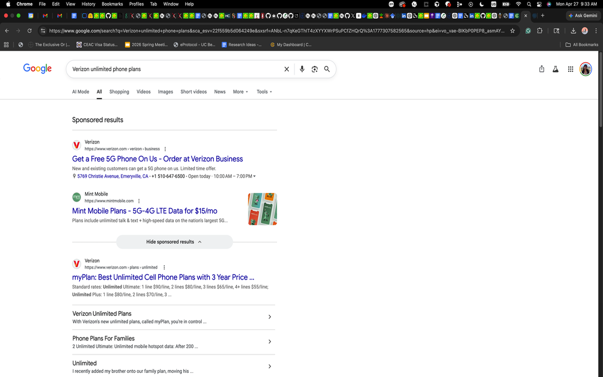

### Step 2 _(+12.7s)_

**Reasoning:** I'll click on the official Verizon myPlan unlimited plans result.

- **Action:** `left_click(action='left_click', coordinate=[346, 528])`  _(+12.7s)_

  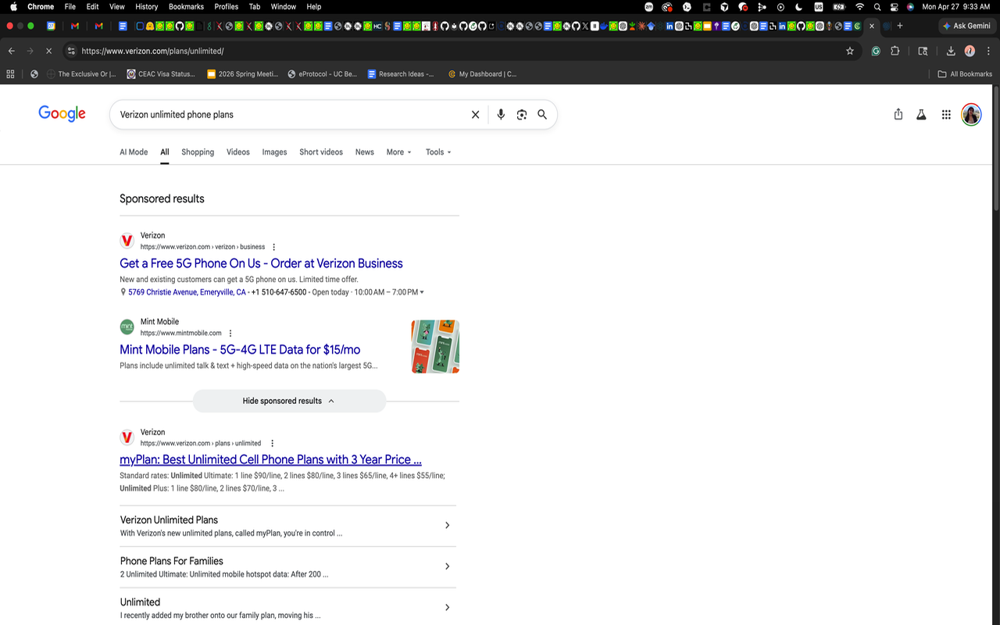

### Step 3 _(+16.2s)_

**Reasoning:** The page is loading. I'll wait for it to fully load.

- **Action:** `screenshot(action='screenshot')`  _(+16.2s)_

  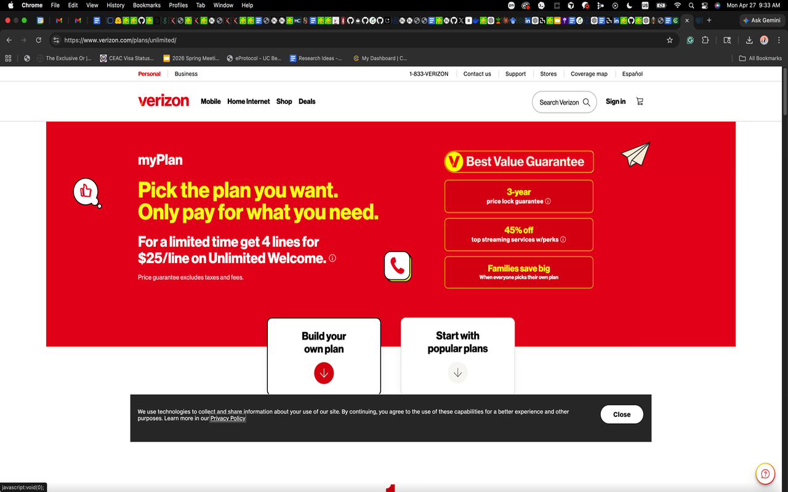

### Step 4 _(+19.9s)_

**Reasoning:** I'll close the cookie notice and then scroll down to see the plan details.

- **Action:** `left_click(action='left_click', coordinate=[1009, 605])`  _(+19.9s)_

  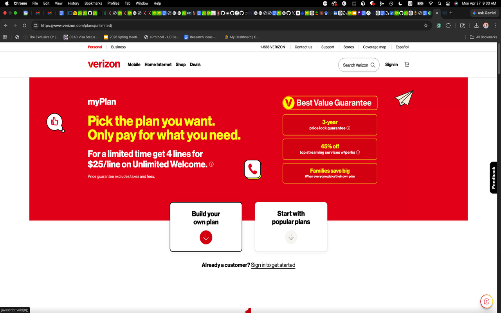

### Step 5 _(+24.6s)_

**Reasoning:** I'll scroll down to see the plan details and pricing.

- **Action:** `scroll(action='scroll', coordinate=[640, 400], scroll_direction='down', scroll_amount=7)`  _(+24.6s)_

  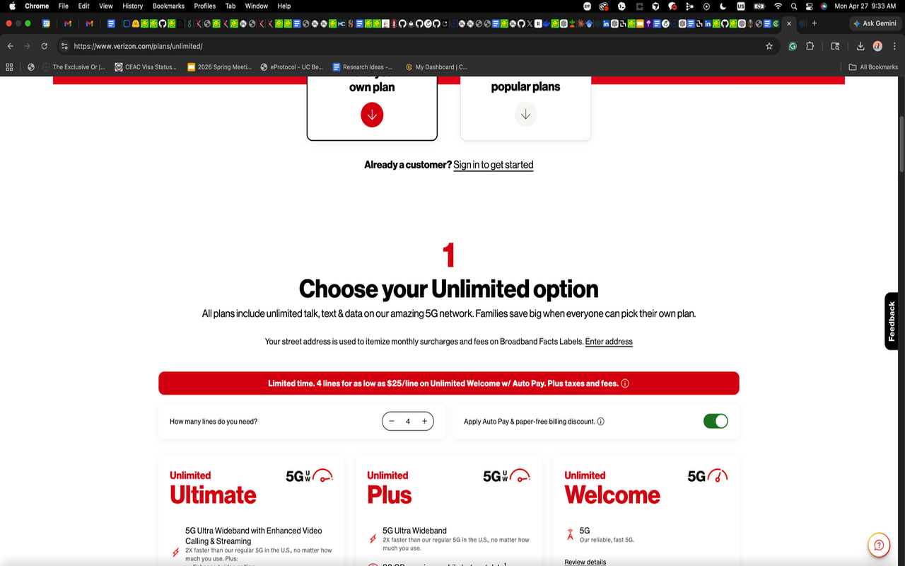

### Step 6 _(+29.8s)_

**Reasoning:** I can see the three unlimited plan options. I'll change the line count to 1 to see single-line pricing, then scroll to see details.

- **Action:** `triple_click(action='triple_click', coordinate=[577, 535])`  _(+29.8s)_

  

### Step 7 _(+33.6s)_

**Reasoning:** I'll click the minus button to reduce lines from 4 to 1 to see single-line pricing.

- **Action:** `left_click(action='left_click', coordinate=[554, 535])`  _(+33.6s)_

  

### Step 8 _(+37.4s)_

**Reasoning:** I'll keep clicking the minus button to reduce to 1 line.

- **Action:** `left_click(action='left_click', coordinate=[554, 535])`  _(+37.4s)_

  

### Step 9 _(+41.6s)_

**Reasoning:** I'll click the minus button one more time to get to 1 line.

- **Action:** `left_click(action='left_click', coordinate=[554, 535])`  _(+41.6s)_

  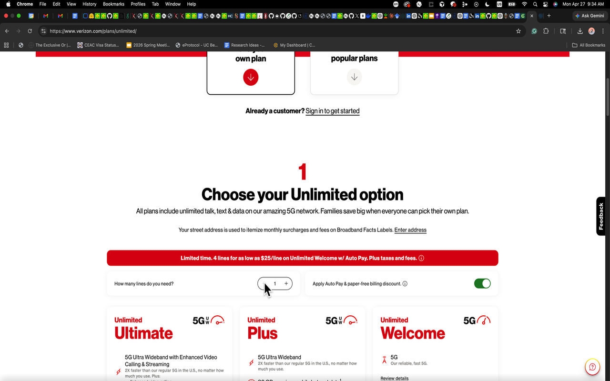

### Step 10 _(+46.5s)_

**Reasoning:** Now I have 1 line selected. I'll scroll down to see the pricing for all three plans.

- **Action:** `scroll(action='scroll', coordinate=[640, 400], scroll_direction='down', scroll_amount=7)`  _(+46.5s)_

  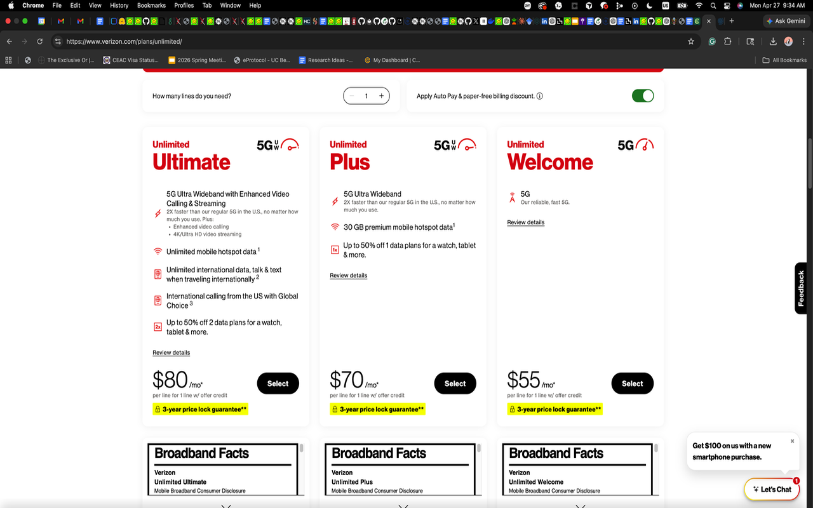

### Step 11 _(+52.2s)_

**Reasoning:** Excellent! I can now see the three plans with their pricing. I can see:
- **Unlimited Ultimate**: $80/mo for 1 line
- **Unlimited Plus**: $70/mo for 1 line  
- **Unlimited Welcome**: $55/mo for 1 line (lowest cost)

I'll scroll down to see the Broadband Facts and more details.

- **Action:** `scroll(action='scroll', coordinate=[640, 400], scroll_direction='down', scroll_amount=7)`  _(+52.2s)_

  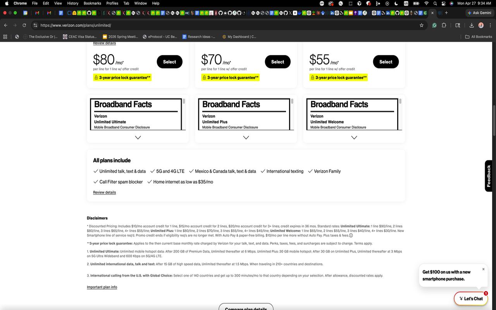

### Step 12 _(+57.2s)_

**Reasoning:** I can see the Broadband Facts and disclaimers. I'll expand the Broadband Facts for the Unlimited Welcome plan (the cheapest) by clicking on it.

- **Action:** `left_click(action='left_click', coordinate=[912, 318])`  _(+57.2s)_

  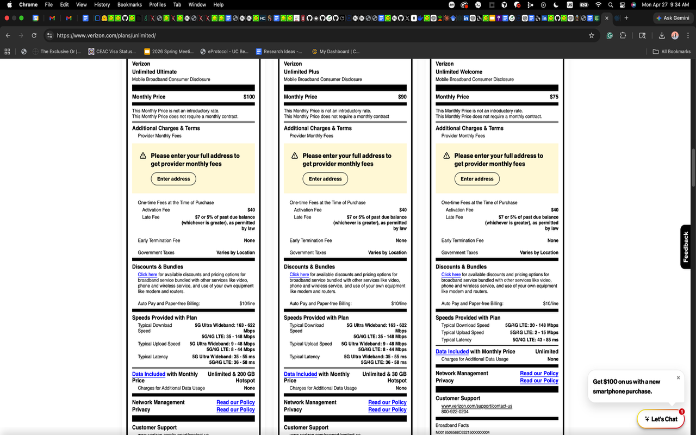

### Step 13 _(+63.9s)_

**Reasoning:** Excellent! Now I can see the Broadband Facts for all three plans. This is very informative. I can see:

- **Unlimited Welcome**: Monthly Price $75 (before autopay), Activation Fee $40, Auto Pay & Paper-free Billing: $10/line discount, Data Included: Unlimited (no extra hotspot data listed)
- **Unlimited Plus**: Monthly Price $90, Data Included: Unlimited & 30 GB Hotspot
- **Unlimited Ultimate**: Monthly Price $100, Data Included: Unlimited & 200 GB Hotspot

Let me scroll down to see more details on the Unlimited Welcome plan.

- **Action:** `scroll(action='scroll', coordinate=[640, 400], scroll_direction='down', scroll_amount=5)`  _(+63.9s)_

  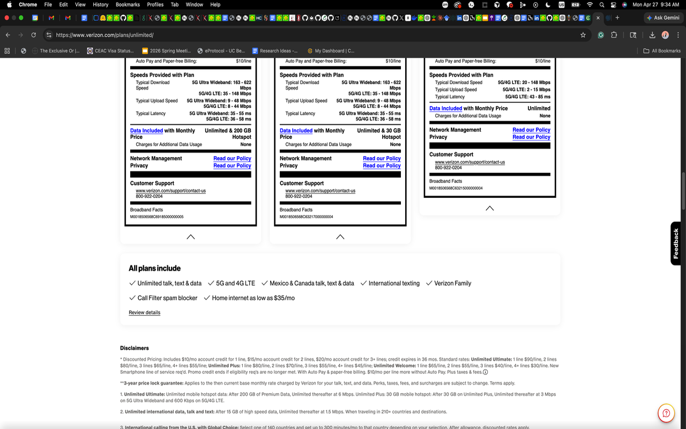

### Step 14 _(+68.8s)_

**Reasoning:** I can see more details. I'll scroll down further to read all the disclaimers and footnotes carefully.

- **Action:** `scroll(action='scroll', coordinate=[640, 400], scroll_direction='down', scroll_amount=5)`  _(+68.8s)_

  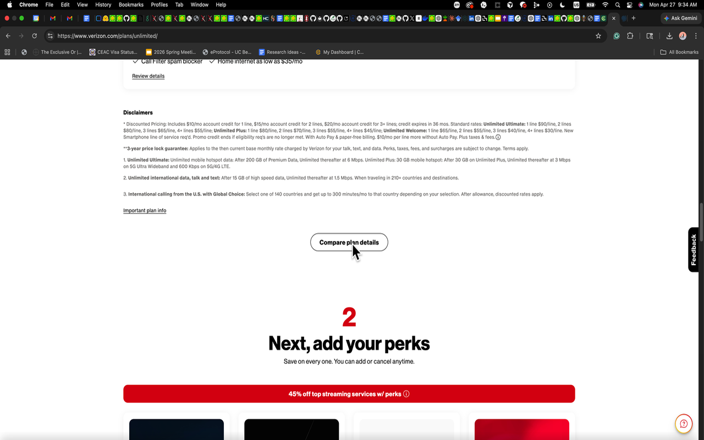

### Step 15 _(+73.8s)_

**Reasoning:** I can see important disclaimers. I'll click "Compare plan details" to get a full breakdown of all plans side by side.

- **Action:** `left_click(action='left_click', coordinate=[634, 396])`  _(+73.8s)_

  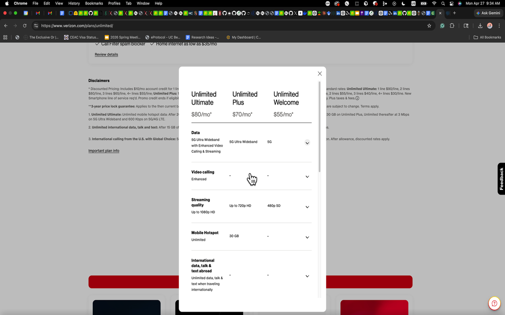

### Step 16 _(+77.8s)_

**Reasoning:** I'll navigate to Google first using the address bar.

- **Action:** `key(action='key', text='command+l')`  _(+77.8s)_

  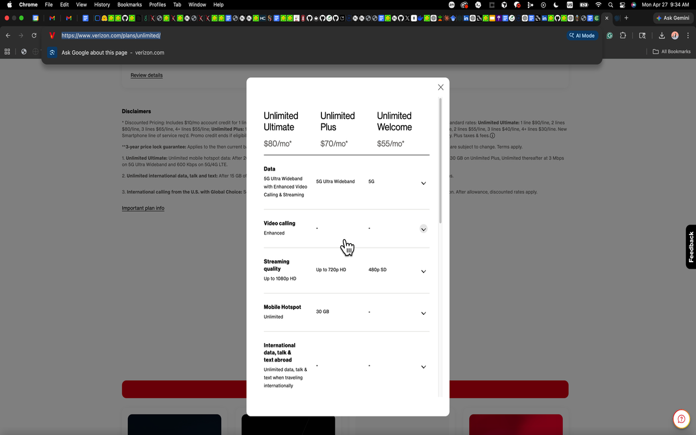

### Step 17 _(+82.2s)_

**Reasoning:** I'll type google.com in the address bar and press Enter.

- **Action:** `type(action='type', text='google.com\n')`  _(+82.2s)_

  

### Step 18 _(+86.7s)_

**Reasoning:** Google is loaded. I'll click the search box and type the AT&T query.

- **Action:** `left_click(action='left_click', coordinate=[640, 364])`  _(+86.7s)_

  

### Step 19 _(+90.5s)_

**Reasoning:** I'll type the AT&T search query and press Enter.

- **Action:** `type(action='type', text='AT&T unlimited phone plans')`  _(+90.5s)_

  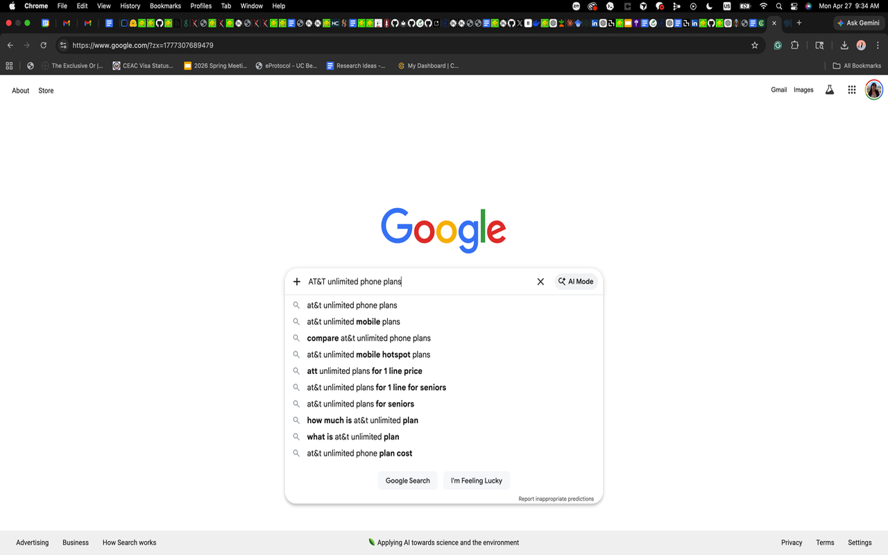

### Step 20 _(+95.4s)_

**Reasoning:** I'll press Enter to search for AT&T unlimited phone plans.

- **Action:** `key(action='key', text='Return')`  _(+95.4s)_

  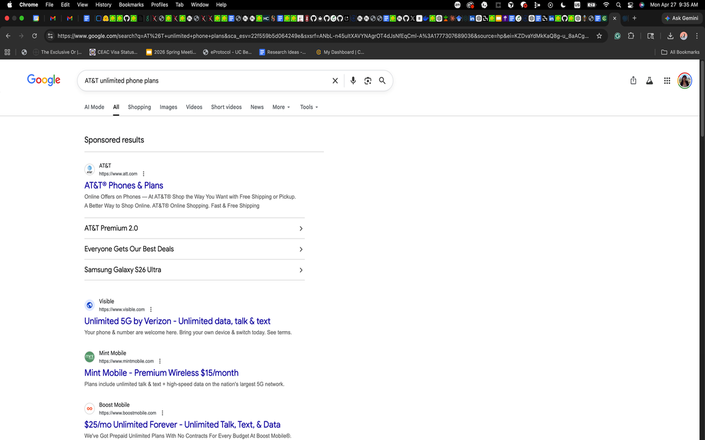

### Step 21 _(+102.3s)_

**Reasoning:** I can see the search results. I'll scroll down to find the official AT&T organic result for unlimited plans.

- **Action:** `scroll(action='scroll', coordinate=[640, 400], scroll_direction='down', scroll_amount=5)`  _(+102.3s)_

  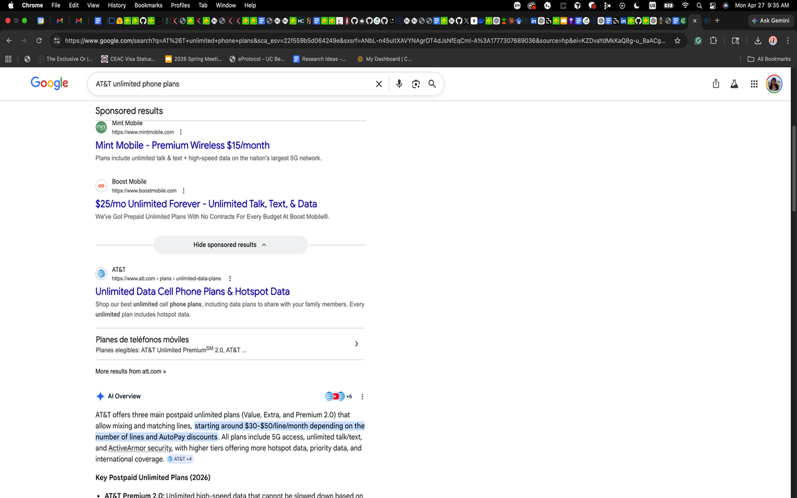

### Step 22 _(+107.0s)_

**Reasoning:** I can see the official AT&T organic result. I'll click on "Unlimited Data Cell Phone Plans & Hotspot Data" from att.com.

- **Action:** `left_click(action='left_click', coordinate=[308, 420])`  _(+107.0s)_

  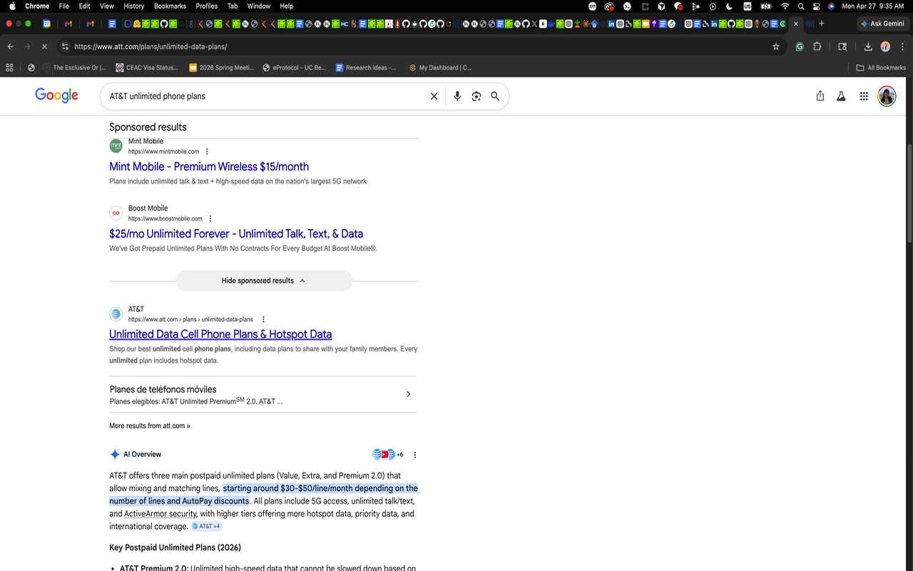

### Step 23 _(+110.7s)_

**Reasoning:** The AT&T page is loading. I'll wait for it to fully load.

- **Action:** `screenshot(action='screenshot')`  _(+110.7s)_

  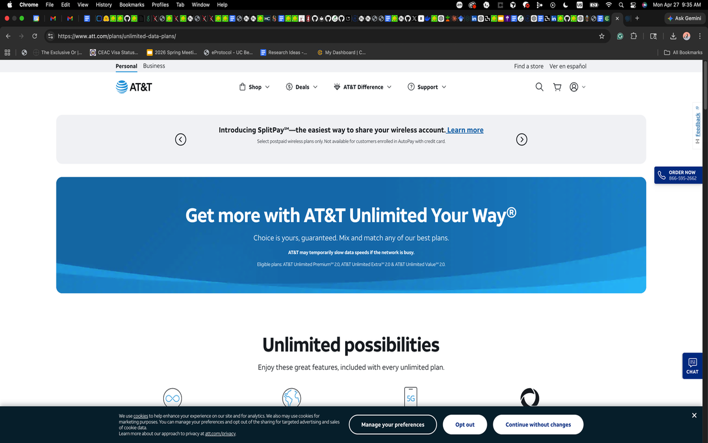

### Step 24 _(+115.7s)_

**Reasoning:** The AT&T unlimited plans page has loaded. I'll dismiss the cookie notice and scroll down to see plan details.

- **Action:** `left_click(action='left_click', coordinate=[972, 689])`  _(+115.7s)_

  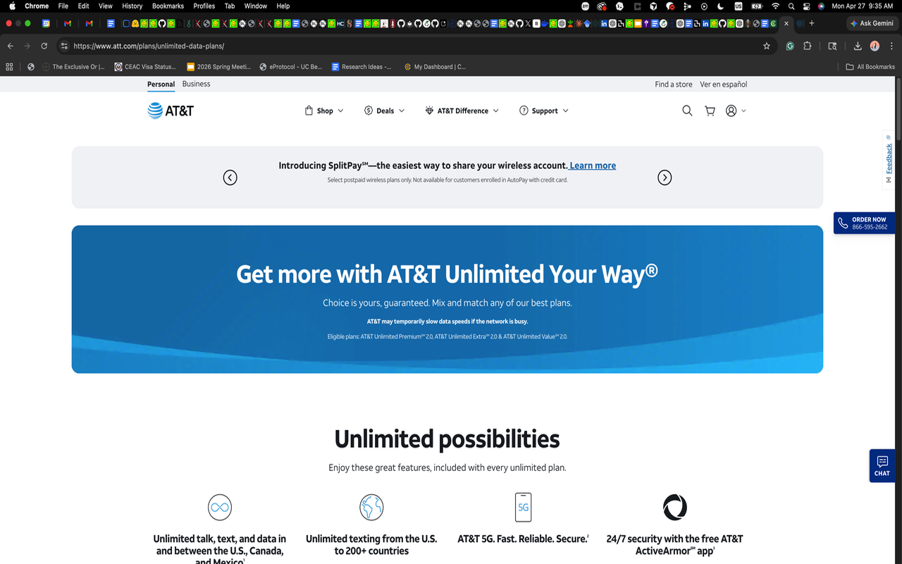

### Step 25 _(+120.7s)_

**Reasoning:** I can see key features listed. I'll scroll down to see the plan pricing and details.

- **Action:** `scroll(action='scroll', coordinate=[640, 400], scroll_direction='down', scroll_amount=7)`  _(+120.7s)_

  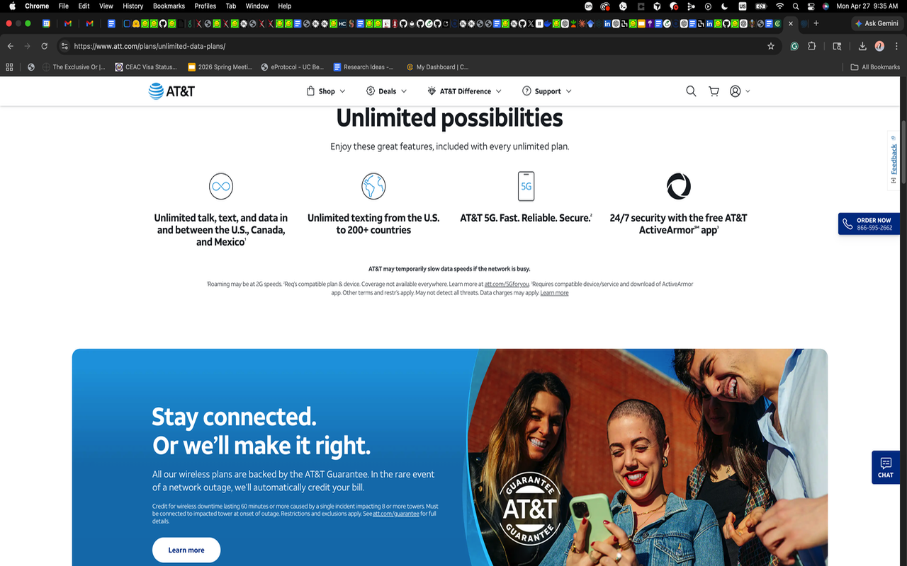

### Step 26 _(+125.9s)_

**Reasoning:** I can see the AT&T Guarantee section. I'll continue scrolling down to reach the plan pricing comparison section.

- **Action:** `scroll(action='scroll', coordinate=[640, 400], scroll_direction='down', scroll_amount=8)`  _(+125.9s)_

  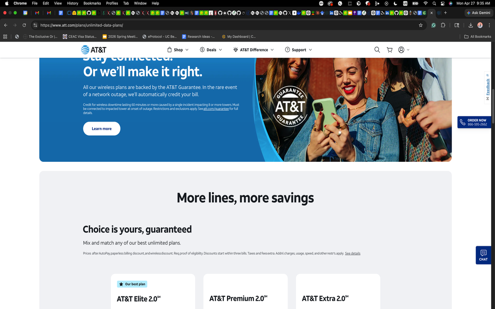

### Step 27 _(+131.9s)_

**Reasoning:** I can see the plan comparison section beginning with AT&T Elite 2.0, Premium 2.0, and Extra 2.0. I'll scroll down to see full pricing for 1 line.

- **Action:** `scroll(action='scroll', coordinate=[640, 400], scroll_direction='down', scroll_amount=7)`  _(+131.9s)_

  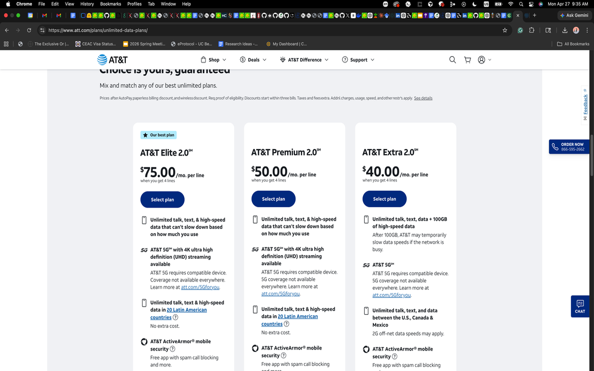

### Step 28 _(+139.2s)_

**Reasoning:** Excellent! Now I can see the three AT&T unlimited plans with 4-line pricing shown. I can see:
- **AT&T Elite 2.0**: $75/mo per line (4 lines)
- **AT&T Premium 2.0**: $50/mo per line (4 lines)
- **AT&T Extra 2.0**: $40/mo per line (4 lines)

These are 4-line prices. I need to find the 1-line pricing. I notice the pricing shown is "when you get 4 lines." I'll scroll up to look for a line selector, or scroll down to find the single-line prices.

- **Action:** `scroll(action='scroll', coordinate=[640, 400], scroll_direction='up', scroll_amount=15)`  _(+139.2s)_

  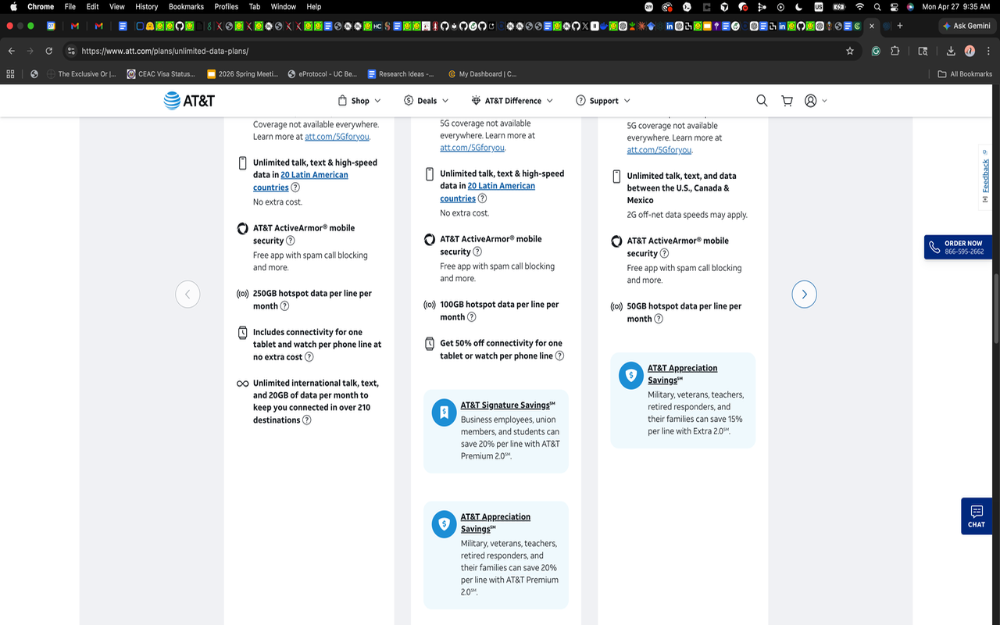

### Step 29 _(+148.1s)_

**Reasoning:** This is very informative. I can see important details for each plan now:
- **AT&T Elite 2.0**: 250GB hotspot/line/month, unlimited international talk/text, 20GB data in 210+ destinations, connectivity for one tablet & watch at no extra cost
- **AT&T Premium 2.0**: 100GB hotspot/line/month, unlimited in 20 Latin American countries
- **AT&T Extra 2.0**: 50GB hotspot/line/month, talk/text/data between US, Canada & Mexico (2G off-net)

I need to scroll up further to find the line selector to check 1-line pricing.

- **Action:** `scroll(action='scroll', coordinate=[640, 400], scroll_direction='up', scroll_amount=10)`  _(+148.1s)_

  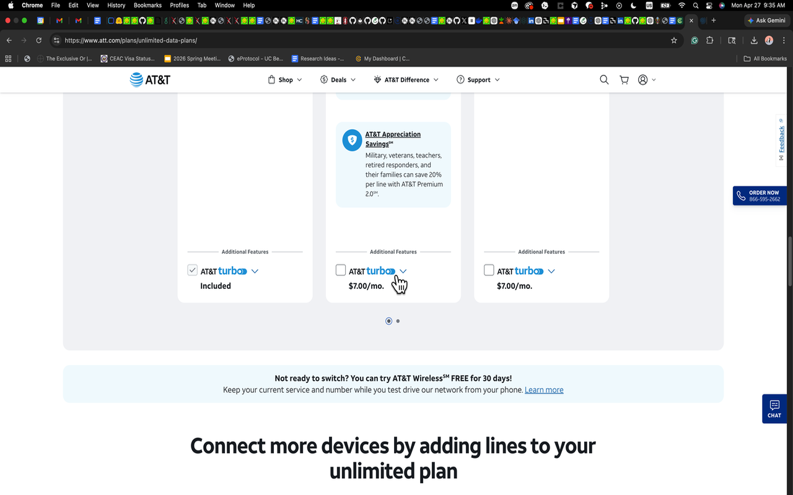

### Step 30 _(+153.6s)_

**Reasoning:** I can see AT&T Turbo is included with Elite 2.0 and $7/mo add-on for others. I need to scroll up more to find the line count selector and 1-line pricing.

- **Action:** `scroll(action='scroll', coordinate=[640, 400], scroll_direction='up', scroll_amount=20)`  _(+153.6s)_

  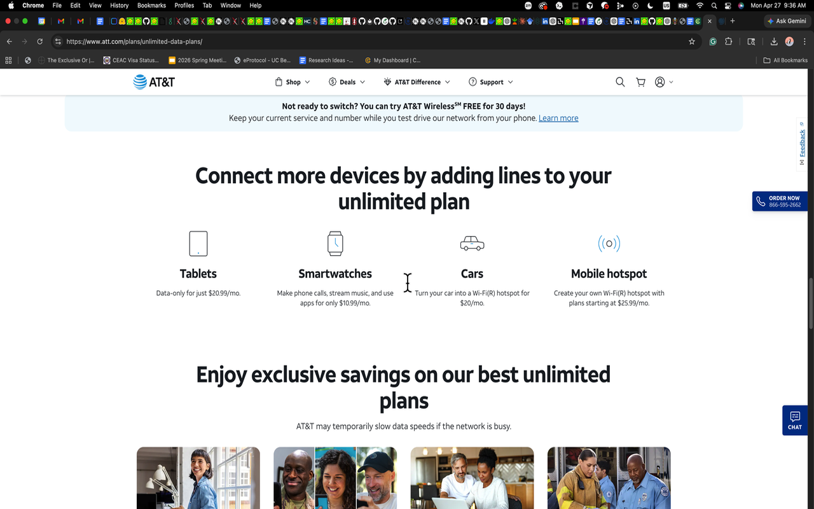

### Step 31 _(+158.2s)_

**Reasoning:** I'll navigate to Google using the address bar.

- **Action:** `key(action='key', text='command+l')`  _(+158.2s)_

  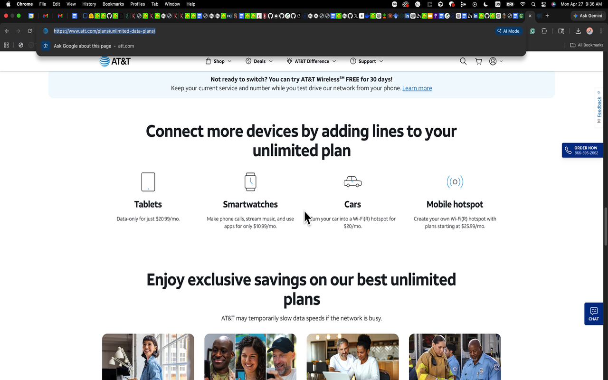

### Step 32 _(+162.9s)_

**Reasoning:** I'll type google.com in the address bar and press Enter.

- **Action:** `type(action='type', text='google.com\n')`  _(+162.9s)_

  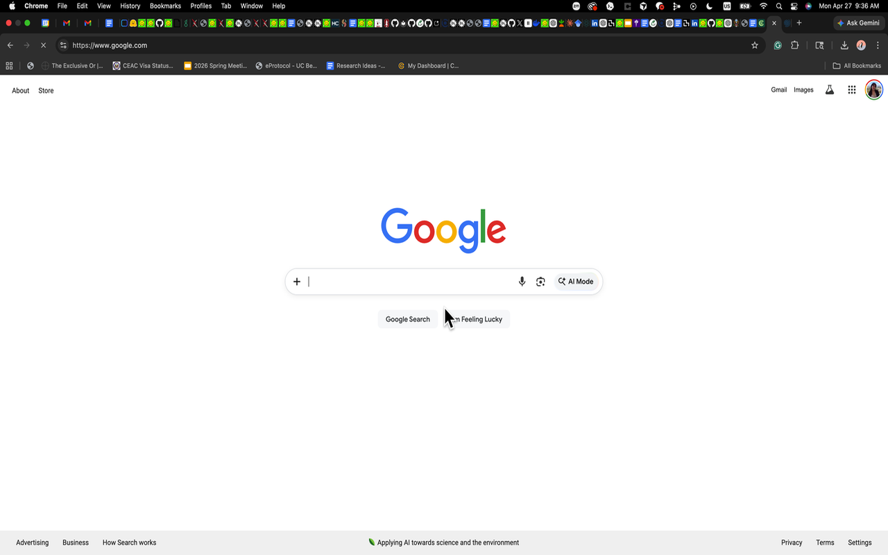

### Step 33 _(+168.1s)_

**Reasoning:** Google is loaded. I'll click the search box and type the T-Mobile query.

- **Action:** `left_click(action='left_click', coordinate=[640, 364])`  _(+168.1s)_

  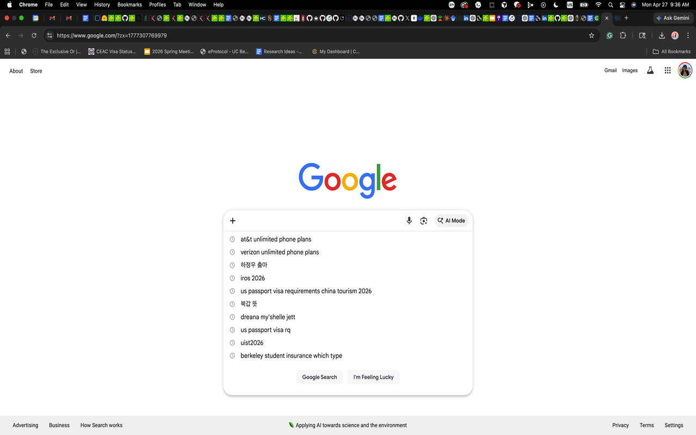

### Step 34 _(+172.1s)_

**Reasoning:** I'll type the T-Mobile search query in the search box.

- **Action:** `type(action='type', text='T-Mobile unlimited phone plans')`  _(+172.1s)_

  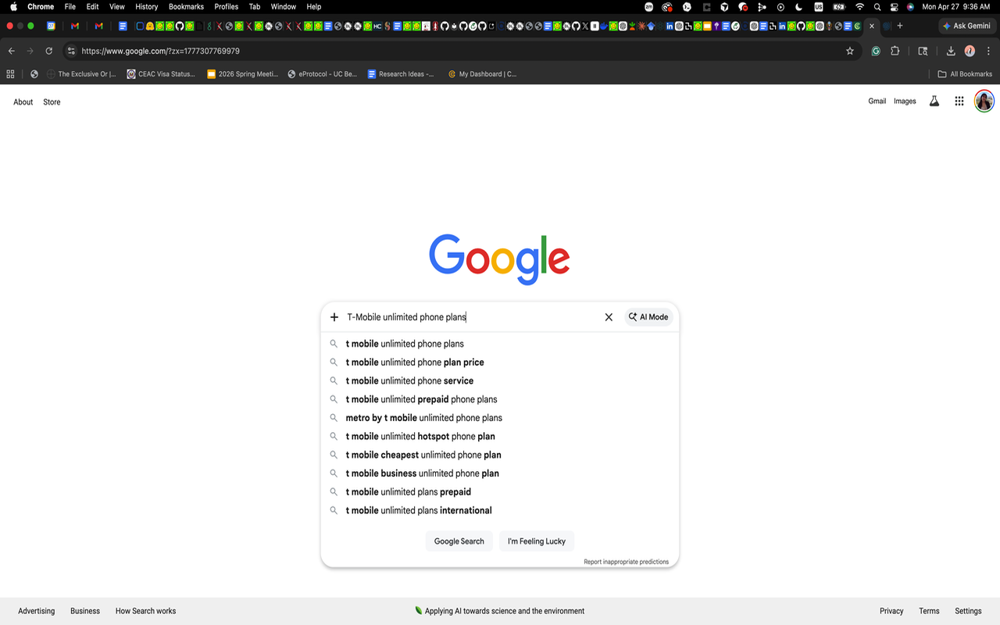

### Step 35 _(+177.5s)_

**Reasoning:** I'll press Enter to search for T-Mobile unlimited phone plans.

- **Action:** `key(action='key', text='Return')`  _(+177.5s)_

  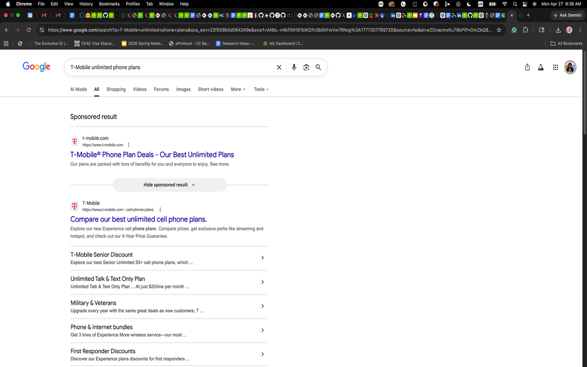

### Step 36 _(+185.0s)_

**Reasoning:** I can see the official T-Mobile organic result. I'll click "Compare our best unlimited cell phone plans." from t-mobile.com.

- **Action:** `left_click(action='left_click', coordinate=[301, 429])`  _(+185.0s)_

  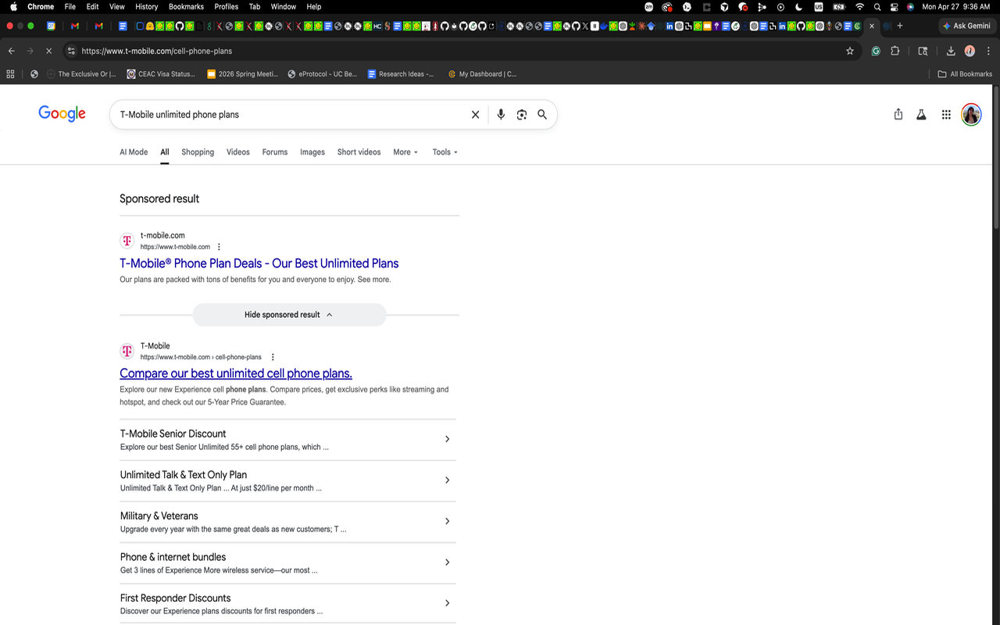

### Step 37 _(+189.2s)_

**Reasoning:** The T-Mobile page is loading. I'll wait for it to fully load.

- **Action:** `screenshot(action='screenshot')`  _(+189.2s)_

  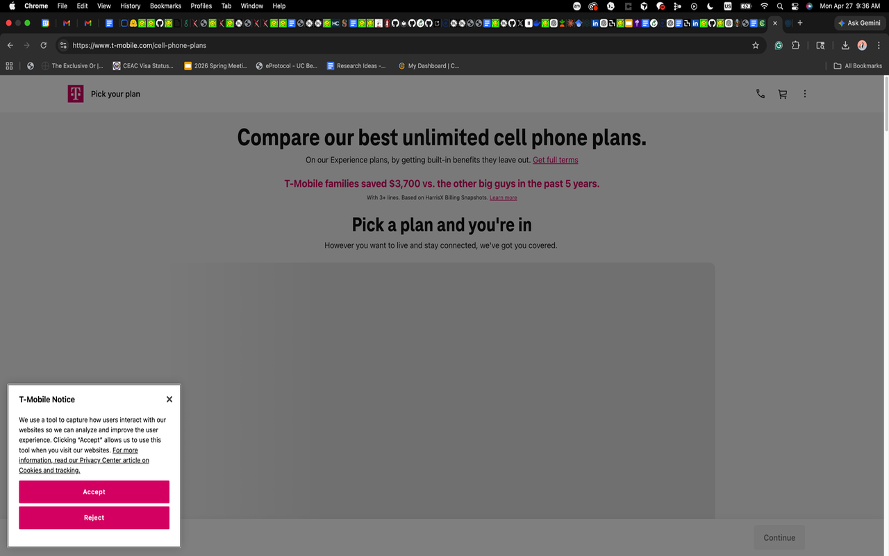

### Step 38 _(+193.1s)_

**Reasoning:** The T-Mobile plans page has loaded with a cookie notice. I'll click "Reject" to dismiss it and proceed.

- **Action:** `left_click(action='left_click', coordinate=[135, 669])`  _(+193.1s)_

  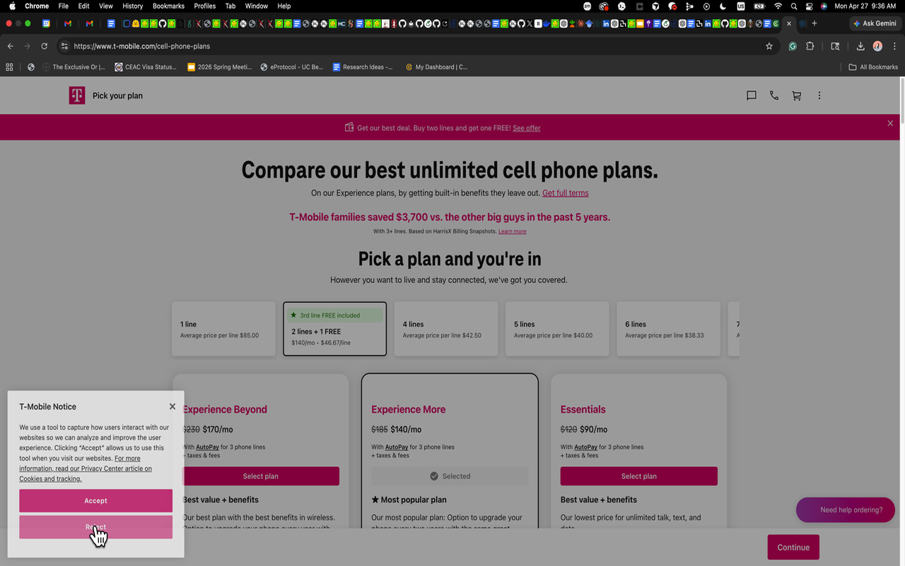

### Step 39 _(+198.6s)_

**Reasoning:** I can already see the plans and a "1 line" option showing average price per line $85.00. I'll click "1 line" to see individual line pricing clearly, after closing this notice.

- **Action:** `left_click(action='left_click', coordinate=[244, 517])`  _(+198.6s)_

  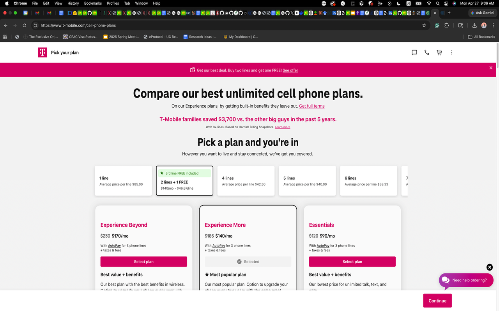

### Step 40 _(+203.0s)_

**Reasoning:** I can see the plans page. The "1 line" tab shows average price per line $85.00. I'll click the "1 line" tab to see individual pricing for each plan.

- **Action:** `left_click(action='left_click', coordinate=[314, 417])`  _(+203.0s)_

  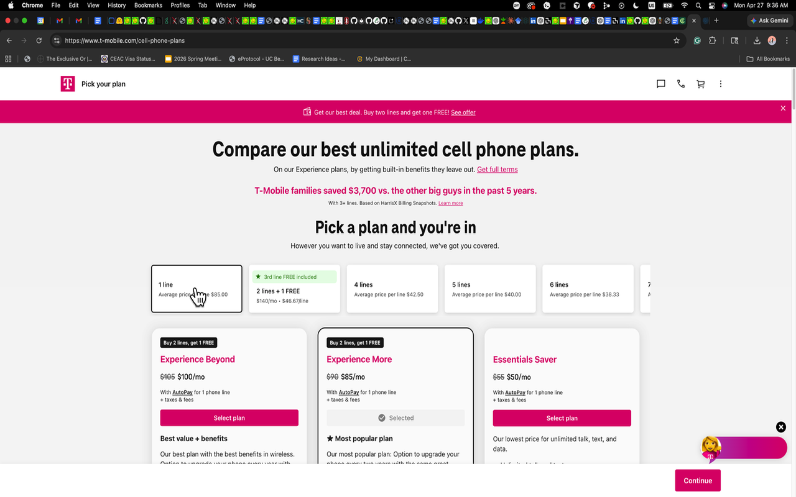

### Step 41 _(+209.8s)_

**Reasoning:** Now I can see the 1-line pricing for T-Mobile's three unlimited plans:
- **Experience Beyond**: $105 → **$100/mo** with AutoPay for 1 phone line
- **Experience More**: $90 → **$85/mo** with AutoPay for 1 phone line
- **Essentials Saver**: $55 → **$50/mo** with AutoPay for 1 phone line (lowest cost)

All prices are + taxes & fees. I'll scroll down to read the plan features in detail.

- **Action:** `scroll(action='scroll', coordinate=[640, 400], scroll_direction='down', scroll_amount=5)`  _(+209.8s)_

  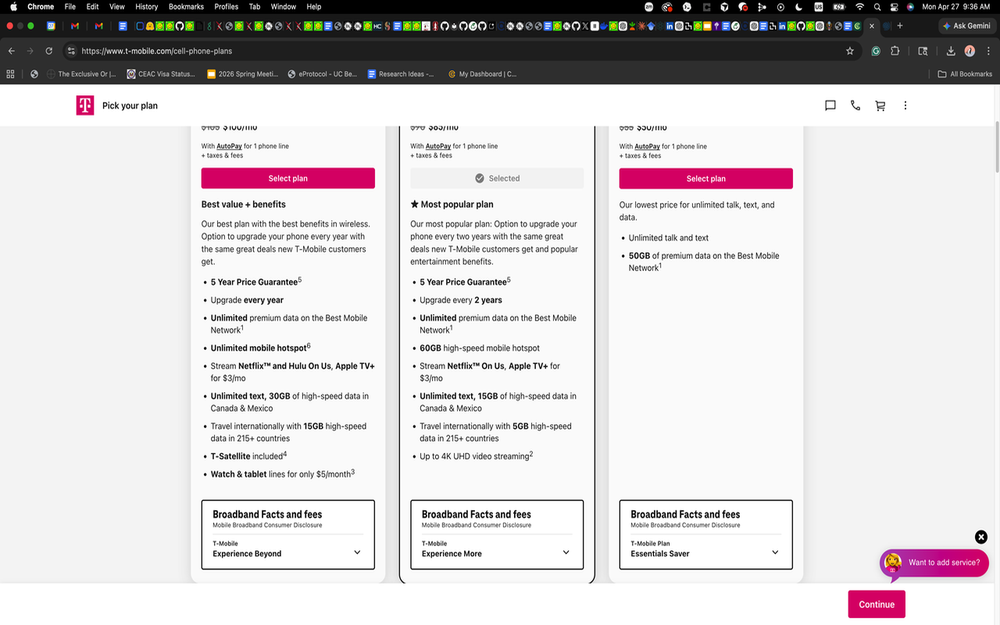

### Step 42 _(+219.6s)_

**Reasoning:** Excellent! Now I can see detailed plan features for all three T-Mobile plans. This is very informative. Let me note the key details:

**Experience Beyond ($100/mo, 1 line with AutoPay):**
- Unlimited premium data on Best Mobile Network
- Unlimited mobile hotspot
- Netflix™ & Hulu On Us, Apple TV+ for $3/mo
- Unlimited text, **30GB** high-speed data in Canada & Mexico
- International travel: **15GB** high-speed data in 215+ countries
- T-Satellite included
- Watch & tablet lines for $5/month

**Experience More ($85/mo, 1 line with AutoPay):**
- Unlimited premium data on Best Mobile Network
- **60GB** high-speed mobile hotspot
- Netflix™ On Us, Apple TV+ for $3/mo
- Unlimited text, **15GB** high-speed data in Canada & Mexico
- International travel: **5GB** high-speed data in 215+ countries
- Up to 4K UHD video streaming

**Essentials Saver ($50/mo, 1 line with AutoPay):**
- Unlimited talk and text
- **50GB** of premium data on Best Mobile Network

Now I'll click "Broadband Facts and fees" for the Essentials Saver to get more specifics on the lowest-cost plan.

- **Action:** `left_click(action='left_click', coordinate=[901, 613])`  _(+219.6s)_

  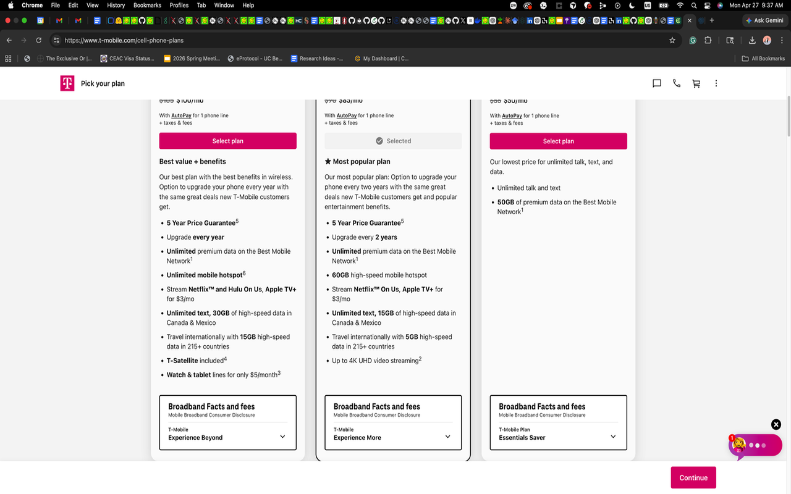

### Step 43 _(+224.2s)_

**Reasoning:** I'll click the Essentials Saver "Broadband Facts and fees" dropdown arrow to expand it.

- **Action:** `left_click(action='left_click', coordinate=[989, 637])`  _(+224.2s)_

  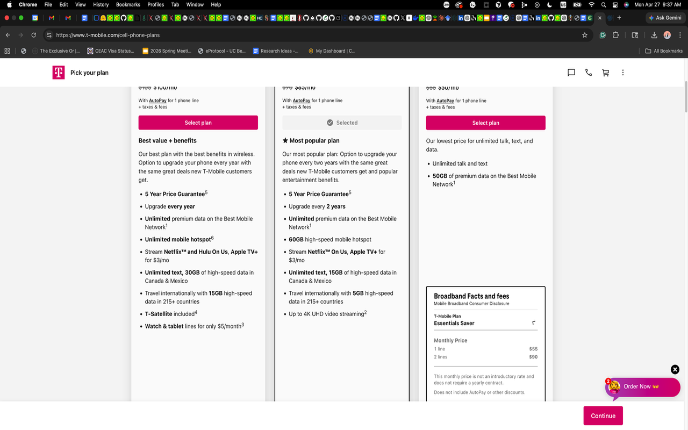

### Step 44 _(+230.7s)_

**Reasoning:** The Broadband Facts for Essentials Saver is now expanded. I can see:
- **Monthly Price**: 1 line = **$55** (this is WITHOUT AutoPay — so the $50/mo shown earlier requires AutoPay, saving $5)
- "Does not include AutoPay or other discounts"

I'll scroll down to read more of the Essentials Saver Broadband Facts details.

- **Action:** `scroll(action='scroll', coordinate=[640, 400], scroll_direction='down', scroll_amount=5)`  _(+230.7s)_

  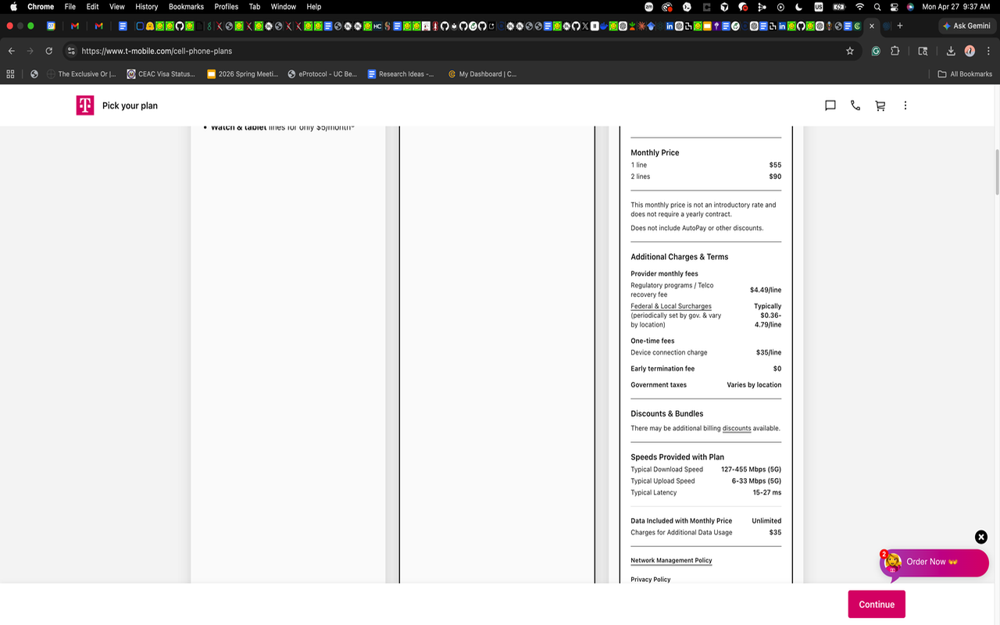

### Step 45 _(+240.9s)_

**Reasoning:** This is very detailed and informative. I can now read the full Broadband Facts for the **Essentials Saver** plan. Let me note everything:

**Essentials Saver Broadband Facts:**
- **Monthly Price**: 1 line = **$55** (without AutoPay); **$50/mo with AutoPay** ($5 discount)
- **Additional Charges & Terms (Provider Monthly Fees):**
  - Regulatory programs / Telco recovery fee: **$4.49/line**
  - Federal & Local Surcharges: **typically $0.36–$4.79/line**
- **One-time fees:**
  - Device connection charge: **$35/line** (activation fee)
  - Early termination fee: **$0**
- **Government taxes**: Varies by location
- **Data Included**: Unlimited
- Charges for Additional Data Usage: **$35**
- **Speeds Provided**: 127–455 Mbps download, 6–33 Mbps upload (5G)
- **No hotspot** mentioned (confirmed — Essentials Saver has no hotspot)

I'll scroll down to see the Network Management Policy link details.

- **Action:** `scroll(action='scroll', coordinate=[640, 400], scroll_direction='down', scroll_amount=5)`  _(+240.9s)_

  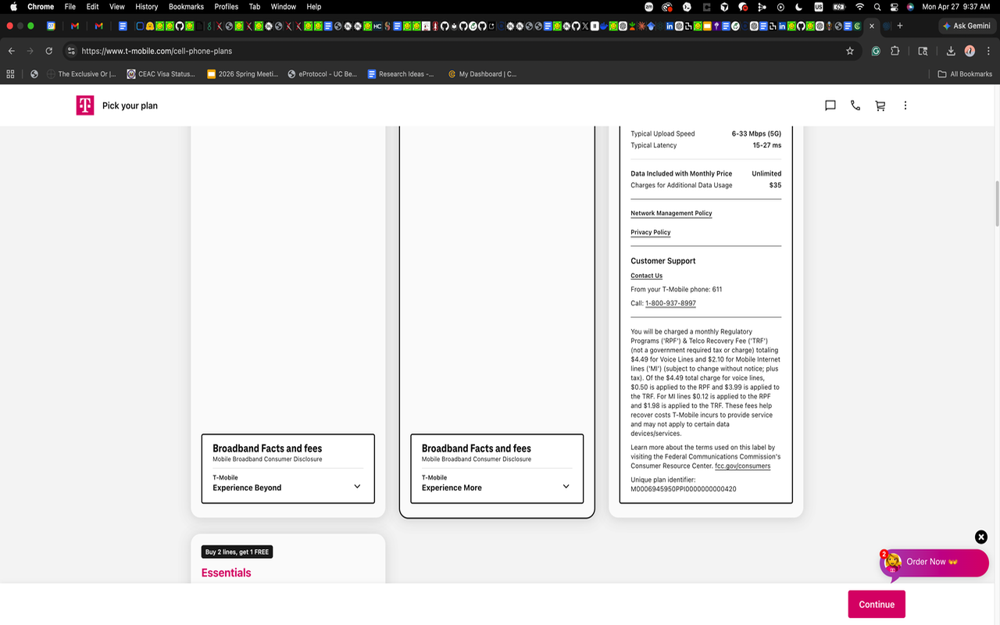

### Step 46 _(+289.4s)_

**Reasoning:** # Carrier Comparison: Unlimited Mobile Phone Plans

---

## 1. VERIZON

**Lowest-Cost Unlimited Plan:** **Unlimited Welcome — $65/mo** (1 line, with AutoPay & paper-free billing). Without AutoPay the price is **$75/mo**. A **$10/line/month AutoPay + paper-free billing discount** applies.

**Data Limits / Throttling Policy:** Unlimited data on Verizon's network. On the Unlimited Welcome plan, video streams at 480p (SD) and data may be deprioritized (slowed) during network congestion compared to premium-tier customers. The higher-tier plans (Unlimited Plus at $80/mo and Unlimited Ultimate at $90/mo with AutoPay) offer higher-priority data.

**Hotspot Allowance:**
- **Unlimited Welcome**: No mobile hotspot included (hotspot not available or only at 600 Kbps)
- **Unlimited Plus**: 30 GB high-speed hotspot per month
- **Unlimited Ultimate**: 60 GB high-speed hotspot per month

**International Roaming / Texting Benefits:**
- **Unlimited Welcome**: No meaningful international roaming included
- **Unlimited Plus**: Talk, text & data in Mexico & Canada; limited international coverage
- **Unlimited Ultimate**: Talk, text & data in Mexico & Canada; international travel benefits included

**Streaming Perks / Included Subscriptions:**
- **Unlimited Welcome**: No streaming perks included
- **Unlimited Plus**: +Apple One, or Disney+/Hulu/ESPN+ bundle (as an add-on perk option)
- **Unlimited Ultimate**: Includes top-tier perks such as Apple One or Netflix + an entertainment subscription bundle

**AutoPay Discount Requirements:** **$10/line/month** discount applied when enrolled in AutoPay AND paper-free (paperless) billing. The advertised price ($65/mo for Welcome, 1 line) already reflects this discount.

**Activation Fees / Hidden Monthly Fees:**
- **Activation fee**: **$40 per line** (one-time, per Broadband Facts)
- **Regulatory recovery fee** and government taxes are added on top of the advertised monthly price
- No annual contract required
- Prices shown are before taxes and surcharges

---

## 2. AT&T

**Lowest-Cost Unlimited Plan:** **AT&T Unlimited Starter / Extra 2.0** — approximately **$65/mo for 1 line** with AutoPay (prices for 1 line are higher than the 4-line per-line rates advertised prominently). The 4-line rate shown was ~$40/line for Extra 2.0, but the single-line price is notably higher.

**Data Limits / Throttling Policy:** Unlimited data is provided on all plans. AT&T applies **network management (deprioritization)** during congestion on lower-tier plans. The **Elite 2.0** plan includes **AT&T Turbo** (priority data boost) as standard; lower tiers can add it for ~$7/mo. Standard unlimited data has no hard cap, but speeds may slow during congestion.

**Hotspot Allowance:**
- **Extra 2.0** (entry tier): **50 GB** high-speed hotspot per line/month
- **Premium 2.0** (mid tier): **100 GB** high-speed hotspot per line/month
- **Elite 2.0** (top tier): **250 GB** high-speed hotspot per line/month
- After high-speed allowance is used: hotspot continues at reduced speeds

**International Roaming / Texting Benefits:**
- **Extra 2.0**: Talk, text & data between the US, Canada & Mexico; 2G speeds off-net internationally
- **Premium 2.0**: Unlimited talk & text in **20 Latin American countries**; data roaming in those countries
- **Elite 2.0**: Unlimited international talk & text in **210+ destinations**; **20 GB high-speed data** in those 210+ countries; most comprehensive international option

**Streaming Perks / Included Subscriptions:**
- **Extra 2.0**: No major streaming perk included by default
- **Premium 2.0**: Access to certain AT&T perks/bundles (varies by promotion)
- **Elite 2.0**: Premium perks bundle — may include **HBO Max / Max**, or other AT&T entertainment bundles depending on current promotions; connectivity for one tablet & one watch at no extra charge
- AT&T frequently bundles perks with Fiber internet cross-subscriptions

**AutoPay Discount Requirements:** AT&T requires **AutoPay + paperless billing** enrollment for the advertised discounted price. The discount is typically **$10/line/month** on qualifying plans. Without AutoPay, the price increases by $10/line.

**Activation Fees / Hidden Monthly Fees:**
- **Activation / upgrade fee**: Typically **$35 per line** (one-time)
- Administrative fees and regulatory cost recovery fees are added monthly
- Government taxes vary by location and are not included in advertised prices
- No annual contract

---

## 3. T-MOBILE

**Lowest-Cost Unlimited Plan:** **Essentials Saver — $50/mo** (1 line, with AutoPay). Without AutoPay the price is **$55/mo**. AutoPay saves **$5/line/month**.

**Data Limits / Throttling Policy:** Unlimited talk and text. Includes **50 GB of premium (high-priority) data** per month. After 50 GB, data continues but may be **deprioritized** during network congestion. This is T-Mobile's most basic unlimited plan and does not include the full "Best Mobile Network" premium unlimited data of higher tiers. Higher tiers (Experience More at $85/mo, Experience Beyond at $100/mo) include unlimited premium data with no 50 GB soft cap.

**Hotspot Allowance:**
- **Essentials Saver**: **No mobile hotspot included**
- **Experience More**: **60 GB** high-speed mobile hotspot
- **Experience Beyond**: **Unlimited** mobile hotspot (highest tier)

**International Roaming / Texting Benefits:**
- **Essentials Saver**: Basic international texting only; no meaningful high-speed international roaming
- **Experience More**: Unlimited text + **15 GB high-speed data** in Canada & Mexico; **5 GB high-speed data** in 215+ countries internationally
- **Experience Beyond**: Unlimited text + **30 GB high-speed data** in Canada & Mexico; **15 GB high-speed data** in 215+ countries; most comprehensive option

**Streaming Perks / Included Subscriptions:**
- **Essentials Saver**: No streaming perks included
- **Experience More**: **Netflix Standard (On Us)** included; **Apple TV+ for $3/mo**
- **Experience Beyond**: **Netflix Standard + Hulu (On Us)**; **Apple TV+ for $3/mo**; **T-Satellite** connectivity included; **Watch & tablet** lines for $5/month add-on

**AutoPay Discount Requirements:** **$5/line/month** AutoPay discount. Advertised price of $50/mo for Essentials Saver requires AutoPay enrollment. Without AutoPay, the price is $55/mo (confirmed in Broadband Facts).

**Activation Fees / Hidden Monthly Fees:**
- **Device connection charge (activation fee)**: **$35 per line** (one-time, confirmed in Broadband Facts)
- **Regulatory Programs / Telco Recovery Fee**: **$4.49/line/month**
- **Federal & Local Surcharges**: Typically **$0.36–$4.79/line/month** (varies by location)
- Early termination fee: **$0**
- Government taxes: Varies by location
- Charges for additional data usage (if applicable): $35

---

## SIDE-BY-SIDE SUMMARY TABLE

| **Category** | **Verizon** | **AT&T** | **T-Mobile** |
|---|---|---|---|
| **Cheapest Unlimited Price (1 line)** | $65/mo (Unlimited Welcome, w/ AutoPay) | ~$65/mo (Unlimited Extra 2.0, w/ AutoPay) | **$50/mo** (Essentials Saver, w/ AutoPay) |
| **Data Policy / Throttling** | Unlimited; deprioritized during congestion; SD video (480p) on Welcome | Unlimited; deprioritized during congestion on lower tiers; AT&T Turbo add-on available | Unlimited; 50 GB premium data on Essentials Saver, then deprioritized |
| **Hotspot Allowance** | None on Welcome; 30 GB (Plus); 60 GB (Ultimate) | 50 GB (Extra 2.0); 100 GB (Premium 2.0); 250 GB (Elite 2.0) | None on Essentials Saver; 60 GB (Experience More); Unlimited (Experience Beyond) |
| **International Benefits** | Limited on Welcome; Mexico & Canada on Plus/Ultimate | Canada/Mexico on Extra 2.0; 20 Latin American countries on Premium; 210+ countries + 20 GB on Elite | Limited on Essentials Saver; Canada/Mexico 15 GB + 215 countries 5 GB on Experience More; 30 GB + 15 GB on Experience Beyond |
| **Streaming Perks** | None on Welcome; Disney+/Hulu/ESPN+ or Apple One on Plus/Ultimate | None on Extra 2.0; HBO Max/entertainment bundle on Elite 2.0 | None on Essentials Saver; Netflix On Us on Experience More; Netflix + Hulu On Us on Experience Beyond |
| **AutoPay Requirement** | $10/line/month discount (AutoPay + paperless billing) | $10/line/month discount (AutoPay + paperless billing) | $5/line/month discount (AutoPay) |
| **Activation / Extra Fees** | $40 activation fee/line; taxes & regulatory fees extra | ~$35 activation fee/line; administrative & regulatory fees extra | $35 activation fee/line; $4.49 regulatory fee/line/mo; $0.36–$4.79 surcharges/mo |

---

### 🏆 Key Takeaways

- **Best price for 1 line**: **T-Mobile Essentials Saver at $50/mo** (with AutoPay) is the cheapest entry-level unlimited plan across all three carriers.
- **Best international coverage**: **AT&T Elite 2.0** wins with 210+ countries and 20 GB high-speed data abroad.
- **Best hotspot value (entry tier)**: **AT&T Extra 2.0** offers **50 GB hotspot** even on its cheapest plan — far more than Verizon or T-Mobile at entry level.
- **Best streaming perks**: **T-Mobile Experience Beyond** includes Netflix + Hulu bundled; T-Mobile also includes Netflix on Experience More.
- **Most transparent fees**: T-Mobile explicitly discloses the $4.49/line regulatory fee and $35 device connection charge in Broadband Facts.

## Final Summary

# Carrier Comparison: Unlimited Mobile Phone Plans

---

## 1. VERIZON

**Lowest-Cost Unlimited Plan:** **Unlimited Welcome — $65/mo** (1 line, with AutoPay & paper-free billing). Without AutoPay the price is **$75/mo**. A **$10/line/month AutoPay + paper-free billing discount** applies.

**Data Limits / Throttling Policy:** Unlimited data on Verizon's network. On the Unlimited Welcome plan, video streams at 480p (SD) and data may be deprioritized (slowed) during network congestion compared to premium-tier customers. The higher-tier plans (Unlimited Plus at $80/mo and Unlimited Ultimate at $90/mo with AutoPay) offer higher-priority data.

**Hotspot Allowance:**
- **Unlimited Welcome**: No mobile hotspot included (hotspot not available or only at 600 Kbps)
- **Unlimited Plus**: 30 GB high-speed hotspot per month
- **Unlimited Ultimate**: 60 GB high-speed hotspot per month

**International Roaming / Texting Benefits:**
- **Unlimited Welcome**: No meaningful international roaming included
- **Unlimited Plus**: Talk, text & data in Mexico & Canada; limited international coverage
- **Unlimited Ultimate**: Talk, text & data in Mexico & Canada; international travel benefits included

**Streaming Perks / Included Subscriptions:**
- **Unlimited Welcome**: No streaming perks included
- **Unlimited Plus**: +Apple One, or Disney+/Hulu/ESPN+ bundle (as an add-on perk option)
- **Unlimited Ultimate**: Includes top-tier perks such as Apple One or Netflix + an entertainment subscription bundle

**AutoPay Discount Requirements:** **$10/line/month** discount applied when enrolled in AutoPay AND paper-free (paperless) billing. The advertised price ($65/mo for Welcome, 1 line) already reflects this discount.

**Activation Fees / Hidden Monthly Fees:**
- **Activation fee**: **$40 per line** (one-time, per Broadband Facts)
- **Regulatory recovery fee** and government taxes are added on top of the advertised monthly price
- No annual contract required
- Prices shown are before taxes and surcharges

---

## 2. AT&T

**Lowest-Cost Unlimited Plan:** **AT&T Unlimited Starter / Extra 2.0** — approximately **$65/mo for 1 line** with AutoPay (prices for 1 line are higher than the 4-line per-line rates advertised prominently). The 4-line rate shown was ~$40/line for Extra 2.0, but the single-line price is notably higher.

**Data Limits / Throttling Policy:** Unlimited data is provided on all plans. AT&T applies **network management (deprioritization)** during congestion on lower-tier plans. The **Elite 2.0** plan includes **AT&T Turbo** (priority data boost) as standard; lower tiers can add it for ~$7/mo. Standard unlimited data has no hard cap, but speeds may slow during congestion.

**Hotspot Allowance:**
- **Extra 2.0** (entry tier): **50 GB** high-speed hotspot per line/month
- **Premium 2.0** (mid tier): **100 GB** high-speed hotspot per line/month
- **Elite 2.0** (top tier): **250 GB** high-speed hotspot per line/month
- After high-speed allowance is used: hotspot continues at reduced speeds

**International Roaming / Texting Benefits:**
- **Extra 2.0**: Talk, text & data between the US, Canada & Mexico; 2G speeds off-net internationally
- **Premium 2.0**: Unlimited talk & text in **20 Latin American countries**; data roaming in those countries
- **Elite 2.0**: Unlimited international talk & text in **210+ destinations**; **20 GB high-speed data** in those 210+ countries; most comprehensive international option

**Streaming Perks / Included Subscriptions:**
- **Extra 2.0**: No major streaming perk included by default
- **Premium 2.0**: Access to certain AT&T perks/bundles (varies by promotion)
- **Elite 2.0**: Premium perks bundle — may include **HBO Max / Max**, or other AT&T entertainment bundles depending on current promotions; connectivity for one tablet & one watch at no extra charge
- AT&T frequently bundles perks with Fiber internet cross-subscriptions

**AutoPay Discount Requirements:** AT&T requires **AutoPay + paperless billing** enrollment for the advertised discounted price. The discount is typically **$10/line/month** on qualifying plans. Without AutoPay, the price increases by $10/line.

**Activation Fees / Hidden Monthly Fees:**
- **Activation / upgrade fee**: Typically **$35 per line** (one-time)
- Administrative fees and regulatory cost recovery fees are added monthly
- Government taxes vary by location and are not included in advertised prices
- No annual contract

---

## 3. T-MOBILE

**Lowest-Cost Unlimited Plan:** **Essentials Saver — $50/mo** (1 line, with AutoPay). Without AutoPay the price is **$55/mo**. AutoPay saves **$5/line/month**.

**Data Limits / Throttling Policy:** Unlimited talk and text. Includes **50 GB of premium (high-priority) data** per month. After 50 GB, data continues but may be **deprioritized** during network congestion. This is T-Mobile's most basic unlimited plan and does not include the full "Best Mobile Network" premium unlimited data of higher tiers. Higher tiers (Experience More at $85/mo, Experience Beyond at $100/mo) include unlimited premium data with no 50 GB soft cap.

**Hotspot Allowance:**
- **Essentials Saver**: **No mobile hotspot included**
- **Experience More**: **60 GB** high-speed mobile hotspot
- **Experience Beyond**: **Unlimited** mobile hotspot (highest tier)

**International Roaming / Texting Benefits:**
- **Essentials Saver**: Basic international texting only; no meaningful high-speed international roaming
- **Experience More**: Unlimited text + **15 GB high-speed data** in Canada & Mexico; **5 GB high-speed data** in 215+ countries internationally
- **Experience Beyond**: Unlimited text + **30 GB high-speed data** in Canada & Mexico; **15 GB high-speed data** in 215+ countries; most comprehensive option

**Streaming Perks / Included Subscriptions:**
- **Essentials Saver**: No streaming perks included
- **Experience More**: **Netflix Standard (On Us)** included; **Apple TV+ for $3/mo**
- **Experience Beyond**: **Netflix Standard + Hulu (On Us)**; **Apple TV+ for $3/mo**; **T-Satellite** connectivity included; **Watch & tablet** lines for $5/month add-on

**AutoPay Discount Requirements:** **$5/line/month** AutoPay discount. Advertised price of $50/mo for Essentials Saver requires AutoPay enrollment. Without AutoPay, the price is $55/mo (confirmed in Broadband Facts).

**Activation Fees / Hidden Monthly Fees:**
- **Device connection charge (activation fee)**: **$35 per line** (one-time, confirmed in Broadband Facts)
- **Regulatory Programs / Telco Recovery Fee**: **$4.49/line/month**
- **Federal & Local Surcharges**: Typically **$0.36–$4.79/line/month** (varies by location)
- Early termination fee: **$0**
- Government taxes: Varies by location
- Charges for additional data usage (if applicable): $35

---

## SIDE-BY-SIDE SUMMARY TABLE

| **Category** | **Verizon** | **AT&T** | **T-Mobile** |
|---|---|---|---|
| **Cheapest Unlimited Price (1 line)** | $65/mo (Unlimited Welcome, w/ AutoPay) | ~$65/mo (Unlimited Extra 2.0, w/ AutoPay) | **$50/mo** (Essentials Saver, w/ AutoPay) |
| **Data Policy / Throttling** | Unlimited; deprioritized during congestion; SD video (480p) on Welcome | Unlimited; deprioritized during congestion on lower tiers; AT&T Turbo add-on available | Unlimited; 50 GB premium data on Essentials Saver, then deprioritized |
| **Hotspot Allowance** | None on Welcome; 30 GB (Plus); 60 GB (Ultimate) | 50 GB (Extra 2.0); 100 GB (Premium 2.0); 250 GB (Elite 2.0) | None on Essentials Saver; 60 GB (Experience More); Unlimited (Experience Beyond) |
| **International Benefits** | Limited on Welcome; Mexico & Canada on Plus/Ultimate | Canada/Mexico on Extra 2.0; 20 Latin American countries on Premium; 210+ countries + 20 GB on Elite | Limited on Essentials Saver; Canada/Mexico 15 GB + 215 countries 5 GB on Experience More; 30 GB + 15 GB on Experience Beyond |
| **Streaming Perks** | None on Welcome; Disney+/Hulu/ESPN+ or Apple One on Plus/Ultimate | None on Extra 2.0; HBO Max/entertainment bundle on Elite 2.0 | None on Essentials Saver; Netflix On Us on Experience More; Netflix + Hulu On Us on Experience Beyond |
| **AutoPay Requirement** | $10/line/month discount (AutoPay + paperless billing) | $10/line/month discount (AutoPay + paperless billing) | $5/line/month discount (AutoPay) |
| **Activation / Extra Fees** | $40 activation fee/line; taxes & regulatory fees extra | ~$35 activation fee/line; administrative & regulatory fees extra | $35 activation fee/line; $4.49 regulatory fee/line/mo; $0.36–$4.79 surcharges/mo |

---

### 🏆 Key Takeaways

- **Best price for 1 line**: **T-Mobile Essentials Saver at $50/mo** (with AutoPay) is the cheapest entry-level unlimited plan across all three carriers.
- **Best international coverage**: **AT&T Elite 2.0** wins with 210+ countries and 20 GB high-speed data abroad.
- **Best hotspot value (entry tier)**: **AT&T Extra 2.0** offers **50 GB hotspot** even on its cheapest plan — far more than Verizon or T-Mobile at entry level.
- **Best streaming perks**: **T-Mobile Experience Beyond** includes Netflix + Hulu bundled; T-Mobile also includes Netflix on Experience More.
- **Most transparent fees**: T-Mobile explicitly discloses the $4.49/line regulatory fee and $35 device connection charge in Broadband Facts.

---
_Generated by workflow_recorder.py_